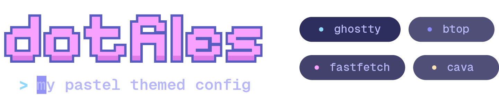

  

### JetBrains IDE Theme
#### JavaScript

  

#### Python

  

### Terminal

  

### Palette

  

 

> [!NOTE]
> The colors used are heavily inspired by [Catppucchin Macchiato](https://github.com/catppuccin)
